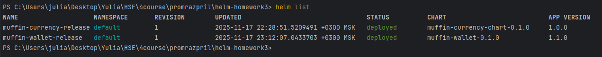
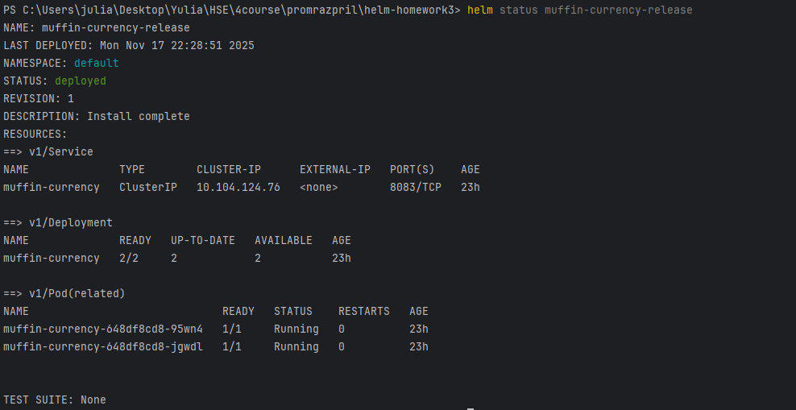
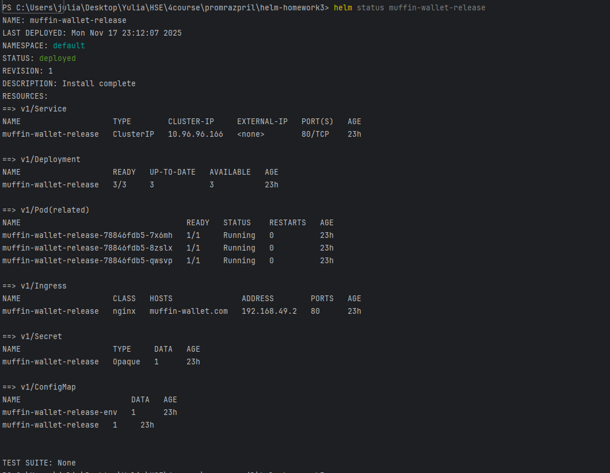
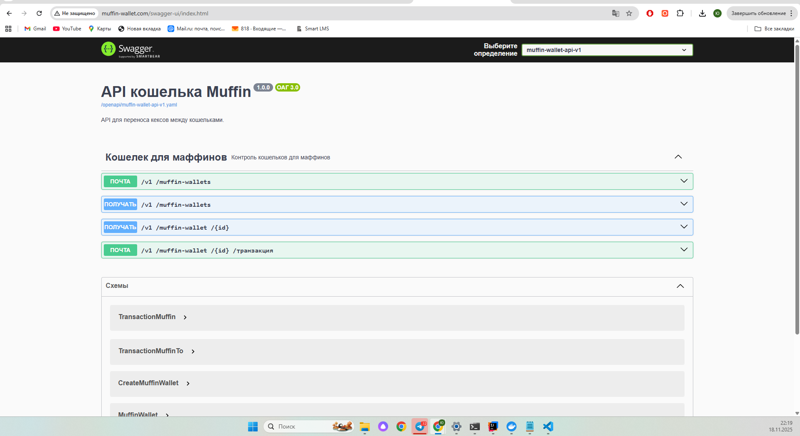

# ДЗ 2. Helm. Промышленное развертывание промышленных приложений.

## Выполнила Кухтина Юлия Егоровна, БПИ224

## Выполненные шаги

### 1. Создание helm чарта для приложения muffin-currency
Здесь исходя из комментариев на предыдущей защите почистила лишнее, оставила только необходимое для работы с нужным манифестом.

### 2. Создание helm чарта для приложения muffin-wallet
Вынесла значения в файл `values.yaml`. Основная информация о релизе в `Chart.yaml`. Сущности из манифеста в отдельной папке `templates`, чтобы удобно ориентироваться и вносить правки, если они потребуются. Также по примеру одного из готовых хельм чартов решила сделать вспомогательный файл `_helpers.tpl` для вынесения констант, которые используется в метках ресурсов.

### 3. Установка
* Развернула БД в докере так же, как это было сделано в большой домашке
* Проверила наполнение будущих манифестов для релизов командами:

```
helm lint muffin-currency-chart # показывает, есть ли ошибки в синтаксисе
helm template muffin-currency-chart # показывает будущие манифесты
helm lint muffin-wallet-chart
helm template muffin-wallet-chart
```
* Установила релизы
```
helm install muffin-currency-release ./muffin-currency-chart
helm install muffin-wallet-release ./muffin-wallet-chart

helm list # Список релизов
```

* Проверила статус релизов
```
helm status muffin-currency-release
helm status muffin-wallet-release
```



* Проверила работу в браузере, для этого:
1.
```
minikube tunnel # включает туннелирование, выполнила в отдельной вкладке
```
2. Добавила в hosts хост из манифеста `muffin-wallet.com`
3. Открыла в браузере `muffin-wallet.com`



### 4. Полезные команды по helm:

#### Создание чарта
```
helm create muffin-currency-chart
```

#### Тестово посмотреть на файлы

```
helm install --dry-run test-release ./muffin-currency-chart
```

#### Установить релиз
```
helm install muffin-currency-release ./muffin-currency-chart
```

#### Установка с переопределениеем значений
```
helm install muffin-currency-release ./muffin-currency \
  --set replicaCount=3 \
  --set image.tag="1.1.0" \
  --set service.port=8084
```

#### Список всех релизов
```
helm list
```

#### Статус конкретного релиза
```
helm status muffin-currency-release
```

#### История релиза
```
helm history muffin-currency-release
```

### Получить значения релиза
```
helm get values muffin-currency-release
```

####  Обновление с новыми values
```
helm upgrade muffin-currency-release ./muffin-currency-chart \
  --set replicaCount=4
```

#### Обновление с новым файлом значений
```
helm upgrade muffin-currency-release ./muffin-currency-chart \
  -f values-production.yaml
```

#### Просмотр истории
```
helm history muffin-currency-release
```

#### Откат к предыдущей версии
```
helm rollback muffin-currency-release 1
```

#### Откат к конкретной версии
```
helm rollback muffin-currency-release 3
```

#### Удаление
```
helm uninstall muffin-currency-release
```
